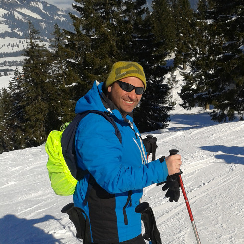

title=About
date=2014-05-23
type=page
status=published
~~~~~~

Well I am from Dublin, I am interested in music, current affairs and politics, I enjoy most sports, and have always been interested in technology.
As a computer programmer, I enjoy using different digitial media and information technologies. I particularly like using open source technology and software.
I love sport, I have supported Chelsea since I was a kid, enduring relegation three times, before the recent era of success, I try to play astro soccer when I can, some years ago when living in Norway I developed the wallet emptying habit of going Sking as bad as I am at it I love it.
I am a computer programmer, developer or whatever monicker is used now, developed in Java and PHP as well as Perl and Cobol in the past, but always keen to learn new technologies. My programming nomme du plume for wordpress websites and bespoke development is www.webwayz.com.

